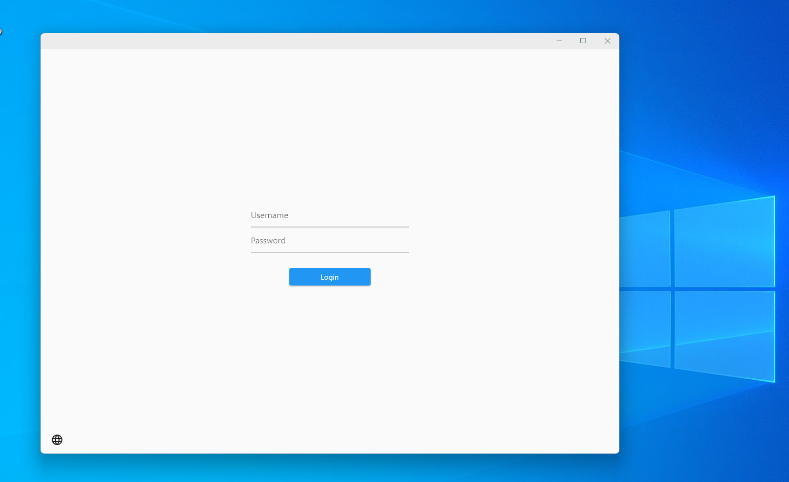
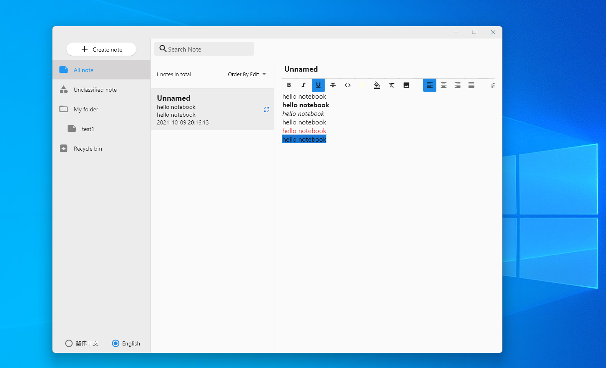

# notebook

[](https://github.com/henjue/notebook/actions/workflows/build_windows.yaml)
[](https://github.com/henjue/notebook/actions/workflows/build_linux.yaml)
[](https://github.com/henjue/notebook/actions/workflows/build_macos.yaml)

## ~~project developing,coming soon!~~
(The new version is under development!)[https://github.com/springeye/oplin]





  
## 1. Install flutter 2.5.1 or Higher
## 2. Enable Desktop support. ref [https://flutter.dev/desktop](https://flutter.dev/desktop)

## Build

```bash
flutter pub get
flutter pub run build_runner build --delete-conflicting-outputs
flutter build windows
flutter build linux
flutter build macos
```
